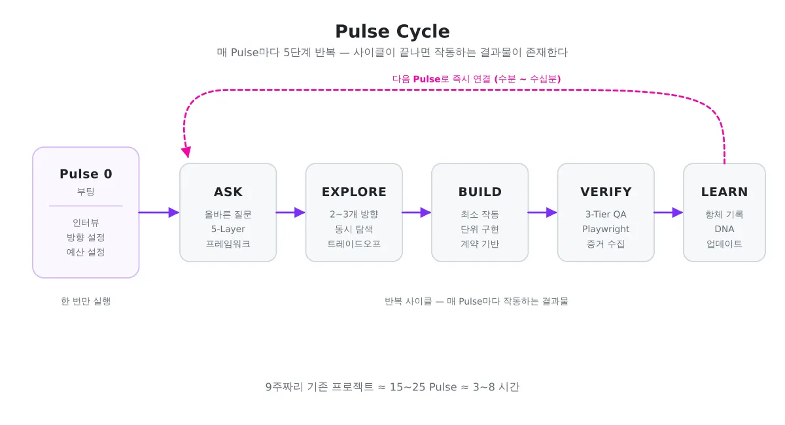
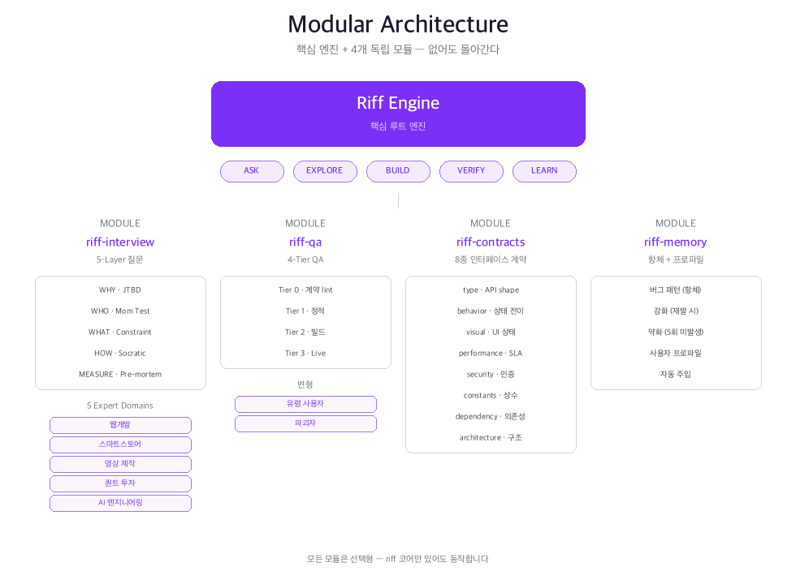

<p align="center">
  <picture>
    <source media="(prefers-color-scheme: dark)" srcset="https://img.shields.io/badge/⚡_PULSE-Right_Questions,_Right_Products-blueviolet?style=for-the-badge&labelColor=1a1a2e&color=7B2FF7&logo=data:image/svg+xml;base64,PHN2ZyB4bWxucz0iaHR0cDovL3d3dy53My5vcmcvMjAwMC9zdmciIHdpZHRoPSIyNCIgaGVpZ2h0PSIyNCIgdmlld0JveD0iMCAwIDI0IDI0IiBmaWxsPSJub25lIiBzdHJva2U9IndoaXRlIiBzdHJva2Utd2lkdGg9IjIiPjxwYXRoIGQ9Ik0yMiAxMmgtNGwtMyA5TDkgM2wtMyA5SDIiLz48L3N2Zz4=" />
    
  </picture>
</p>

<p align="center">
  
  <a href="LICENSE"></a>
  
  
  
  
  <a href="https://github.com/joyuno/pulse/stargazers"></a>
</p>

<p align="center">
  <b>올바른 질문이 올바른 제품을 만든다.</b><br>
  <sub>Right questions, right products.</sub>
</p>

---

# Pulse

**Question-Driven Development** — A Claude Code Plugin

**한국어** | [English (coming soon)]()

코드를 잘 짜는 건 AI가 합니다. 하지만 **"무엇을 만들어야 하는가"는 여전히 사람의 머릿속에 있습니다.**

Pulse는 처음 기획 단계에서 **올바른 질문을 던져서**, 개발 경험이 없는 사람도 자신의 아이디어를 완성도 높은 서비스로 만들 수 있게 해주는 질문 프레임워크입니다.

## Why Pulse?

AI가 아무리 뛰어나도, **질문이 잘못되면 결과도 잘못됩니다.**

```
질문 없이:  "쇼핑몰 만들어줘"
            → AI가 알아서 만듦 → 내가 원하던 게 아님 → 처음부터 다시

질문과 함께: "누가 쓰나? 핵심 문제가 뭔가? 성공 기준은?"
            → 내가 진짜 원하는 게 명확해짐 → AI가 정확히 만듦 → 완성
```

> 문제는 AI의 능력이 아닙니다. **당신의 머릿속에 있는 것을 꺼내는 과정**이 빠져 있었을 뿐입니다.

Pulse는 JTBD(Jobs-to-Be-Done), Mom Test, Pre-mortem, 소크라테스 대화법을 결합한 **5-Layer 질문 프레임워크**로, 기획 단계에서 올바른 의사결정을 유도합니다. 질문이 끝나면, AI가 빠른 반복 루프로 실제 서비스를 만듭니다.

```
Pulse = 올바른 질문(ASK) + 빠른 반복(EXPLORE → BUILD → VERIFY → LEARN)

           ┃┃┃┃┃┃┃┃┃┃┃┃┃┃┃┃┃┃┃┃┃┃┃┃┃┃┃┃┃┃┃┃┃→ 완성
           각 ┃ = 하나의 Pulse (수분~수십분)
           매 Pulse마다 "질문 → 시도 → 검증 → 학습"
```

> 9주짜리 기존 프로젝트 = **15~25 Pulse** = **3~8시간**

---

## Quick Start

### Installation

```shell
# 1. 마켓플레이스 등록
/plugin marketplace add joyuno/pulse

# 2. 핵심 엔진 설치 (이것만으로 동작)
/plugin install pulse@pulse

# 3. 모듈 추가 (선택 — 있으면 더 강력)
/plugin install pulse@pulse-interview    # 소크라테스 인터뷰
/plugin install pulse@pulse-qa           # Tier 0~3 QA + Playwright
/plugin install pulse@pulse-contracts    # 인터페이스 계약 (8종 + lint)
/plugin install pulse@pulse-memory       # 항체 + 사용자 프로파일 (통합)
```

### Direct Installation

```shell
# 글로벌 스킬로 직접 복사
cp -r skills/* ~/.claude/skills/
```

### Usage

Claude Code에서 바로 사용:

```
"프로젝트 시작해줘"
"쇼핑몰 MVP 만들어줘"
"pulse로 시작"
"앱 만들어줘"
```

---

## Optional Companions — Codex 토론 + Ralph 자동 루프

Pulse는 단독으로 동작하지만, 다음 두 플러그인이 함께 있으면 **EXPLORE 단계의 대립 토론**과 **VERIFY 실패 시 자동 수정 루프**가 자동 강화됩니다.

| 컴패니언 | 역할 | 설치 |
|---|---|---|
| [`ralph-loop`](https://github.com/anthropics/claude-code-plugins) | VERIFY 실패 시 통과까지 자동 수정 루프 | `/plugin install ralph-loop@anthropic` |
| [`codex`](https://github.com/openai/codex-plugin-cc) | OpenAI Codex로 적대적 검토·교차 검증 | `/plugin marketplace add openai/codex-plugin-cc` + `/plugin install codex@openai-codex` |

### 자동 부트스트랩

`pulse`를 프로젝트에서 처음 호출하면 다음 의존성을 점검하고 **누락된 것을 사용자에게 한 번 물어 자동 설치**합니다:

1. `ralph-loop` 플러그인 → 누락 시 설치 제안
2. `codex` 플러그인 → 누락 시 설치 제안
3. Codex CLI (`npm install -g @openai/codex`) → 누락 시 자동 설치
4. Codex 로그인 (`!codex login`) → 미인증 시 안내

각 항목마다 **Install / Skip / Skip all**로 on/off 선택 가능. Skip 시 해당 보강 기능만 비활성화하고 Pulse 기본 흐름은 그대로 동작합니다.

### 결합된 흐름

```
PULSE 사이클
├─ ASK         → 사용자
├─ EXPLORE     → 분신술 (Pulse 내장)
│                  └─ 트레이드오프 명확하지 않을 때:
│                       /codex:adversarial-review --wait <focus>
├─ BUILD       → 구현
├─ VERIFY      → pulse-qa Tier 0~3
│                  ├─ 큰 변화(아키텍처·보안·DB 마이그레이션)일 때:
│                  │    /codex:review --wait --scope working-tree (cross-check)
│                  └─ 실패 시 자동:
│                       /ralph-loop:ralph-loop "<failure>" \
│                         --max-iterations 3 \
│                         --completion-promise 'VERIFY_PASSED'
└─ LEARN       → pulse-memory + Codex 의견 반영
```

### Codex 모델 정책

Codex 호출 시 **`--model` 플래그를 자동 명시하지 않습니다**. Codex CLI 기본값이 그 시점 OpenAI의 최신 모델(GPT-5.4-codex 등)이며 자동 업데이트됩니다. 사용자가 `--model spark` 같은 별칭을 명시할 때만 적용.

---

## Architecture

### Pulse Cycle

매 Pulse는 5단계를 반복합니다. 각 사이클 후 **작동하는 결과물**이 존재합니다.

<p align="center">
  
</p>

### Module System

**핵심 원칙: 없어도 돌아가는 모듈 시스템.**

```
pulse만 설치:           pulse + interview:        pulse + 전체:
┌─────────────┐        ┌─────────────┐           ┌─────────────┐
│ ASK: 기본 2개│        │ ASK: 5-Layer│           │ ASK: 전문가  │
│ EXPLORE: 직접│        │ EXPLORE: 동일│           │ EXPLORE: 분신│
│ BUILD: 직접  │        │ BUILD: 동일  │           │ BUILD: 8종   │
│              │        │              │           │       계약+lint│
│ VERIFY: build│        │ VERIFY: 동일 │           │ VERIFY: T0~3 │
│ LEARN: 로그  │        │ LEARN: 동일  │           │ LEARN: memory │
└─────────────┘        └─────────────┘           │   (항체+프로파일)│
     기본 동작              ASK 강화               └─────────────┘
                                                    최대 성능
```

### Modular Architecture

<p align="center">
  
</p>

---

## Features

### 1. Question Engine — 멀티 프레임워크 질문 엔진

> 검증된 4가지 질문법을 결합해서, **비개발자도 AI와 함께 상세 기획을 완성**할 수 있습니다.

```
일반 AI:  "쇼핑몰 만들어줘" → AI가 알아서 만듦 → 내가 원하던 게 아님

Pulse:    "이 제품이 없으면 그 일을 지금 어떻게 하고 있나요?"  ← JTBD
          → "매주 엑셀로 3시간씩 주문 정리해요"
          "지난주에 가장 짜증났던 순간은?"                     ← Mom Test
          → "복붙하다 주문 2건을 빠뜨렸어요"
          "딱 하나의 버튼만 있다면?"                           ← Constraint
          → "주문 자동 확인 버튼이요"
          "3개월 후 실패했다면, 왜?"                           ← Pre-mortem
          → "주문량이 늘면 느려질 것 같아요"
          → 기획 완성 → AI가 정확히 구현
```

**5-Layer 기획 프레임 — 각 Layer에 최적의 질문법:**

| Layer | 프레임워크 | 핵심 질문 | 결정하는 것 |
|-------|-----------|----------|-----------|
| **WHY** | JTBD | 이 제품이 해결할 "일"은? | 핵심 Job, 리스크 태깅 |
| **WHO** | Mom Test | 실제로 지금 어떻게 하고 있나? | 실제 행동 기반 페르소나 |
| **WHAT** | Constraint Forcing | 딱 하나만 만든다면? | MVP 핵심, 우선순위 |
| **HOW** | 소크라테스 | A와 B 중 비용은? | 트레이드오프, 기술 결정 |
| **MEASURE** | Pre-mortem | 실패한다면 이유는? | 리스크 제거, 성공 기준 |

**5개 전문 도메인:**

| 도메인 | 전문가 질문 예시 |
|--------|----------------|
| **웹개발** | SSR vs CSR? 인증 방식? 실시간 필요? |
| **스마트스토어** | 소싱 방식? 자동화 범위? 마진 구조? |
| **영상 제작** | 숏폼/롱폼? AI 활용 범위? 다국어? |
| **퀀트 투자** | 전략 유형? 실행 주기? 리스크 관리? |
| **AI 엔지니어링** | RAG vs 파인튜닝? 가드레일? 비용 최적화? |

---

### 2. Tier 0~3 QA — 4단계 검증 + Live Browser

> 정적 분석으로 잡을 수 있는 건 앞 Tier에서 잡고, **런타임 버그만 Playwright로 검증**합니다.

```
Tier 0: 계약서 lint + 커버리지   비용: 최소  | 계약서 frontmatter, 공유타입 누락 탐지
        ──────────────────────────────────────
Tier 1: 정적 경계면 QA           비용: 낮음 | API shape, 깨진 링크, 상태전이
        ──────────────────────────────────────
Tier 2: 빌드/타입 QA             비용: 중간 | tsc --noEmit, eslint, npm run build
        ──────────────────────────────────────
Tier 3: Live Browser QA          비용: 높음 | Playwright 유저 시나리오, 스크린샷
```

**Tier 3 QA 변형:**

| 변형 | 설명 |
|------|------|
| **유령 사용자** | AI가 스크린샷을 보고 자유 탐색 — 예상 못한 버그 발견 |
| **파괴자** | SQL 인젝션, XSS, 버튼 연타, 초장문 입력 등 비정상 테스트 |
| **시간축** | 상태 변화 흐름 추적 — 새로고침/탭 전환 후에도 일관성 검증 |
| **다중 인격** | 급한 운영자 / 신규 사용자 / 모바일 사용자 등 다양한 관점 |

---

### 3. Interface Contracts — 인터페이스 계약 (8종 + lint)

> 에이전트 간 **500줄 대신 30줄 계약서만 교환**하여 컨텍스트를 ~94% 절약. 작성 직후 self-lint로 실수 사전 차단.

```
기존:  에이전트A ──500줄 전체 코드──→ 에이전트B (낭비)
Pulse: 에이전트A ──30줄 계약서────→ 에이전트B (효율)
```

**8종 계약서:**

| 계약 유형 | 내용 | QA Tier |
|----------|------|---------|
| **type** | API 응답 shape, 타입 시그니처 | Tier 1 |
| **behavior** | 상태 전이, 유저 저니 순서 | Tier 3 |
| **visual** | 컴포넌트 상태, 반응형 브레이크포인트 | Tier 3 |
| **performance** | 응답 시간 SLA, 번들 크기 | Tier 3 |
| **security** | 인증/인가, 입력 검증, CORS | Tier 3 (파괴자) |
| **constants** | 공유 상수 SSOT (길이, rate, 토큰 만료 등) | Tier 0 |
| **dependency** | 라이브러리 버전 핀, 호환성 | Tier 0 |
| **architecture** | 병렬 에이전트 API/모듈/파일 소유권 | Tier 0 + 1 |

**계약서 실수 방지:** 작성 직후 8종별 lint(`contract-lint.md`) → 통과해야 BUILD 진입. 자주 하는 실수(CM-001~020) 카탈로그가 `pulse-memory`의 `contract` 항체로 자동 누적되어 다음 BUILD에 주입.

---

### 4. Pulse Memory — 항체 + 사용자 프로파일 (통합)

> 한번 겪은 실수와 사용자 선호도를 함께 누적하여 다음 Pulse·다음 세션에 자동 적용.

**항체 (6종 type)**

```
버그 발견 → 항체 생성 → 다음 BUILD에 자동 주입
                ↓
            재발 → 강화 (recurrence +1, 체크리스트 확장)
                ↓
       90일 무재발 → weakened (보존만)
```

| type | 적용 영역 |
|------|---------|
| boundary / logic / ui / performance / security | 코드 버그 패턴 |
| **contract** | **계약서 작성 실수** (단위 누락, 종단 가드 누락 등) |

**사용자 프로파일** (`.pulse/memory/profile.md`)

추적: 커뮤니케이션 스타일 / 기술 선호 / 의사결정 패턴 / 코딩 컨벤션
2회 반복 관찰 → 자동 학습. 명시적 피드백("이렇게 하지 마") → 즉시 반영.

---

## AI-Native Patterns

인간이 할 수 없지만 **AI라서 가능한** 7가지 협업 방식:

| 패턴 | 인간 | AI |
|------|------|-----|
| **분신술** | 한 명이 한 관점 | 같은 에이전트를 3개 관점으로 동시 스폰 |
| **시간여행** | 설계→구현→테스트 1회 | 빠른 사이클을 5회 반복, 5번째가 최고 품질 |
| **대립토론** | 회의 정치, 감정 개입 | 순수 논리로 찬성/반대 동시 수행 |
| **되감기** | 3주 진행 후 되돌리면 3주 낭비 | git reset 후 항체/DNA는 보존 |
| **탐색 폭발** | 방법 A를 2주 시도 → 실패 → 방법 B | A, B, C를 동시에 5분간 시도 |
| **미래 시뮬레이션** | "6개월 후 괜찮을까?" 알 수 없음 | 데이터 100만건, 신기능 추가 시나리오 검증 |
| **점진적 확신** | 확신 없어도 일정 때문에 진행 | 확신 낮으면 자동 추가 탐색 |

---

## Use Cases — Try These Prompts

Pulse 설치 후 Claude Code에서 바로 사용:

**E-Commerce MVP**
```
쿠팡 스타일의 주문 관리 대시보드를 만들어줘.
판매자가 주문 확인, 배송 처리, 환불 관리를 할 수 있어야 해.
```

**Smart Store Automation**
```
네이버 스마트스토어 상품 등록을 자동화하는 도구를 만들어줘.
엑셀에서 상품 정보를 읽어서 API로 등록하고 가격을 자동 조정하는 시스템.
```

**Video Content Pipeline**
```
유튜브 숏폼 자동 생성 파이프라인을 만들어줘.
트렌드 주제 수집 → 대본 생성 → TTS → 자막 → 업로드까지.
```

**Quant Trading Bot**
```
바이낸스에서 BTC/USDT 모멘텀 전략으로 자동매매하는 봇을 만들어줘.
백테스트 → 시뮬레이션 → 실거래 순서로 진행하고 리스크 관리 포함.
```

**AI Agent System**
```
RAG 기반 고객 상담 챗봇을 만들어줘.
회사 문서를 벡터 DB에 넣고, 질문에 답변하되 할루시네이션 방지 가드레일 포함.
```

---

## Plugin Structure

```
pulse/
├── .claude-plugin/
│   ├── plugin.json
│   └── marketplace.json
│
├── skills/
│   ├── pulse/                               # Core loop engine
│   │   ├── SKILL.md                         #   ASK→EXPLORE→BUILD→VERIFY→LEARN
│   │   └── references/                      #   build/explore/rewind/convergence/...
│   │
│   ├── pulse-interview/                     # 5-Layer Socratic interview
│   │   ├── SKILL.md
│   │   └── references/                      #   layers, scorecard, domains/, experts/
│   │
│   ├── pulse-contracts/                     # 8종 계약 + lint
│   │   ├── SKILL.md
│   │   └── references/
│   │       ├── contract-lint.md             #   8종 self-check + cross 검증
│   │       ├── contract-mistakes.md         #   CM-001~020 실수 카탈로그(항체 시드)
│   │       ├── stack-patterns.md            #   스택별 탐지/검증 명령
│   │       └── {type|behavior|visual|performance|security|constants|dependency|architecture}.template.md
│   │
│   ├── pulse-qa/                            # Tier 0~3 QA
│   │   ├── SKILL.md
│   │   └── references/                      #   tier1, tier2, tier3, ghost-user, destroyer
│   │
│   └── pulse-memory/                        # 항체 + 프로파일 (통합)
│       ├── SKILL.md
│       └── references/
│           ├── antibody-schema.md           #   6종 type 포함 (boundary/.../contract)
│           └── profile-schema.md            #   단일 프로파일 파일 스키마
│
├── hooks/                                   # SubagentStop 진행률 훅
├── benchmarks/                              # 평가 픽스처
├── docs/                                    # 다이어그램
├── LICENSE
└── README.md
```

### 프로젝트 런타임 디렉토리

Pulse가 동작할 때 사용자 프로젝트에 만들어지는 디렉토리:

```
프로젝트루트/
├── _workspace/                  # git 추적 - 이번 프로젝트 산출물
│   ├── pulse-status.md          # 현재 위치 + 자동화 체크리스트
│   ├── pulse-log.md             # Pulse별 학습 기록
│   ├── contracts/               # 8종 계약서 단일 경로
│   │   ├── README.md
│   │   ├── ui-stack.md
│   │   └── *.md
│   └── pulse-N/                 # Pulse별 결과
│       └── {agent}-result.md
│
└── .pulse/                      # 학습 메모리 + 세션 상태
    ├── memory/
    │   ├── antibodies/          # git 추적 (팀 공유)
    │   │   └── {type}-{name}.md
    │   └── profile.md           # git 미추적 (.gitignore)
    ├── pulse-log.json           # 훅 출력
    └── state.json               # 세션 상태 (.gitignore)
```

## Comparison

|  | Harness | OMC | **Pulse** |
|---|---------|-----|-----------|
| **본질** | 팀을 만든다 | 팀을 굴린다 | **올바른 질문으로 제품을 만든다** |
| **관점** | 인간 팀 모방 | 인간 워크플로우 | **Question-Driven** |
| **시간 단위** | Phase (시간~일) | Task (분~시간) | **Pulse (분)** |
| **설계** | 사전 전체 설계 | 계획→실행 | **점진적 발견** |
| **QA 시점** | 완성 후 | 완성 후 | **매 Pulse** |
| **실패 비용** | 높음 | 중간 | **없음 (되감기)** |
| **학습** | 수동 피드백 | 메모리 수동 | **자동 (항체/DNA)** |
| **조합** | — | — | **Harness/OMC와 함께 사용 가능** |

## Inspired By

- [revfactory/harness](https://github.com/revfactory/harness) — Agent Team & Skill Architect. Pulse의 Progressive Disclosure 패턴과 에이전트 팀 설계는 Harness에서 영감을 받았습니다.

## Requirements

- Claude Code CLI
- [Agent Teams enabled](https://code.claude.com/docs/en/agent-teams): `CLAUDE_CODE_EXPERIMENTAL_AGENT_TEAMS=1`
- Playwright MCP (Tier 3 Live QA 사용 시)

## License

MIT