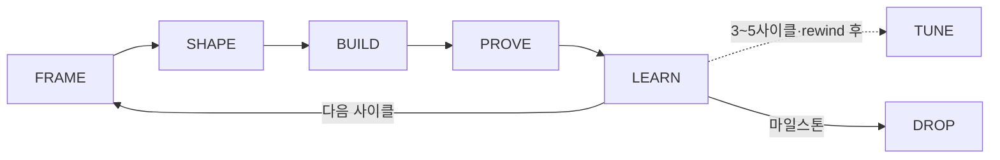

<p align="center">
  <picture>
    <source media="(prefers-color-scheme: dark)" srcset="https://img.shields.io/badge/⚡_RIFF-Right_Questions,_Right_Products-blueviolet?style=for-the-badge&labelColor=1a1a2e&color=7B2FF7&logo=" />
    
  </picture>
</p>

<p align="center">
  
  <a href="LICENSE"></a>
  
  
  
  
  <a href="https://github.com/joyuno/riff/stargazers"></a>
</p>

<p align="center">
  <b>올바른 질문이 올바른 제품을 만든다.</b><br>
  <sub>Right questions, right products.</sub>
</p>

---

# Riff

**질문이 캔버스를 채운다.** Riff는 FRAME → SHAPE → BUILD → PROVE → LEARN 사이클을 빠르게 반복하며, 매 사이클마다 작동하는 결과물과 살아있는 `CANVAS.md`를 남기는 Question-Driven 개발 루프입니다. 마일스톤에서는 DROP(랜딩), 정체·되감기 후에는 TUNE(조율) 이벤트가 사이클 밖에서 개입합니다.

**한국어** | [English (coming soon)]()

코드를 잘 짜는 건 AI가 합니다. 하지만 **"무엇을 만들어야 하는가"는 여전히 사람의 머릿속에 있습니다.**

## Why Riff?

AI가 아무리 뛰어나도, **질문이 잘못되면 결과도 잘못됩니다.**

```
질문 없이:  "쇼핑몰 만들어줘"
            → AI가 알아서 만듦 → 내가 원하던 게 아님 → 처음부터 다시

질문과 함께: "누가 쓰나? 핵심 문제가 뭔가? 성공 기준은?"
            → 내가 진짜 원하는 게 명확해짐 → AI가 정확히 만듦 → 완성
```

> 문제는 AI의 능력이 아닙니다. **당신의 머릿속에 있는 것을 꺼내는 과정**이 빠져 있었을 뿐입니다.

세션이 끊겨도 `CANVAS.md`만 읽으면 재시작됩니다:
```
STATUS       → 현재 Cycle · 진행도 · 다음 액션 한눈에
[1]~[5]      → 문제·결정·계약·검증·항체가 지도로 압축, 전문은 detail/·contracts/에
```

## 사이클


```mermaid
flowchart LR
  F[FRAME] --> S[SHAPE] --> B[BUILD] --> P[PROVE] --> L[LEARN]
  L -->|다음 사이클| F
  L -.->|3~5사이클·rewind 후| T[TUNE]
  L -->|마일스톤| D[DROP]
```

## Quick Start

```shell
/plugin marketplace add joyuno/riff
/plugin install riff@joyuno-riff
```

Claude Code에서 바로 사용:

```
"프로젝트 시작해줘"
"쇼핑몰 MVP 만들어줘"
"riff로 시작"
"앱 만들어줘"
```

## 핵심 기능

### 1. Living Canvas — `_workspace/CANVAS.md`

```
현재 사이클만 상세히. 스테이지 종료 시 해당 섹션 갱신. 섹션 상한 초과 시
오래된 내용은 detail/로 내리고 링크만 남긴다. 완료 사이클은 1줄 요약으로 접는다.
아키텍처·플로우·상태머신은 mermaid 블록으로 그린다.
이 문서의 쓰기는 메인 루프 단독(single-writer) — 서브에이전트는 detail/·contracts/·태스크 보드에만 기록.
```

> **이 문서만으로 재시작 가능해야 한다** — 캔버스는 지도, `detail/`·`contracts/`는 영토.

### 2. Adaptive Depth — 8신호로 깊이 자동 조정

사이클 시작 시 8신호를 가중치 없이 개수만 체크합니다: 같은 패턴 검증됨 · 요구사항 명시적 · 유사 도메인 표준 패턴 존재 · 성공 기준 측정 가능 · 요구 모호하지 않음 · 같은 영역 되감기 없음 · 외부 의존 낮음 · 트레이드오프 분석 완료.

| 체크 수 | 프로파일 | 동작 |
|---|---|---|
| 6+/8 | 단순 | 가정 선언(FRAME 스킵) → SHAPE 스킵 → PROVE-lite(Tier 0+2) |
| 4~5/8 | 보통 | FRAME 2문항 → PROVE Tier 0~2 + 인라인 diff-review |
| <4/8 | 복잡 | 풀 스테이지 + 잼 + Tier 0~3 + 독립 diff-review |

사용자가 "가볍게" / "꼼꼼하게"로 강제 오버라이드할 수 있습니다.

### 3. 모델 라우팅 — 등급별 스폰

| 등급 | 모델 | 용도 |
|---|---|---|
| core | `opus` | BUILD 병렬 핵심 태스크, SHAPE 잼 |
| support | `sonnet` | BUILD 병렬 지원 태스크, PROVE Tier 3 · diff-review |
| trivial | `haiku` | BUILD 병렬 사소한 태스크 |

스폰은 잼 · 병렬 태스크 ≥2 · 컨텍스트 압박일 때만 정당화됩니다 — 그 외 순차 작업은 메인 루프 인라인 실행이 기본입니다.

### 4. 잼 · 이벤트 스테이지

**잼(Jam)**: SHAPE에서 트레이드오프가 불명확하면 대안마다 격리 worktree에서 에이전트가 동시에 PoC를 시도합니다. 결정은 CANVAS [2]에 1행 + detail/ 링크로 남습니다.

**DROP**(랜딩): 잼 병합 · 성공 기준 달성 · 사용자 요청 시 발동. 랜딩 메뉴(merge/PR/keep/discard), worktree 정리, 보안 딥스캔, 카나리 체크를 수행합니다.

**TUNE**(조율): 3~5사이클마다 · 되감기 직후 · 진행 정체 시 발동. 코드-캔버스 재대조(스톡테이크), 데드코드 제거(가드닝), 항체 정리를 수행합니다.

## Companions

Riff는 단독으로 전 기능 동작하지만, 다음 컴패니언이 있으면 자동으로 강화됩니다.

| 컴패니언 | 설치 | 효과 |
|---|---|---|
| [`ralph-loop`](https://github.com/anthropics/claude-code-plugins) | `/plugin install ralph-loop@anthropic` | PROVE 실패 시 통과까지 자동 수정 루프 |
| [`codex`](https://github.com/openai/codex-plugin-cc) | `/plugin marketplace add openai/codex-plugin-cc` + `/plugin install codex@openai-codex` | SHAPE 대립 검토, diff-review cross-check |
| `ecc-plan-canvas` | `npm install -g ecc-universal` | verdict 게이트 브라우저 리뷰(요소 앵커 주석 + 판정) |

없어도 전 기능 동작합니다(네이티브 폴백): ralph-loop 없으면 자체 재시도 후 에스컬레이션, codex 없으면 잼에 반대 관점 에이전트 추가, plan-canvas 없으면 터미널 구조화 질문(approve/request-changes)으로 대체됩니다. 첫 호출 시 누락된 컴패니언을 한 번 물어 자동 설치합니다(Install / Skip / Skip all).

## Use Cases — Try These Prompts

Riff 설치 후 Claude Code에서 바로 사용:

**E-Commerce MVP**
```
쿠팡 스타일의 주문 관리 대시보드를 만들어줘.
판매자가 주문 확인, 배송 처리, 환불 관리를 할 수 있어야 해.
```

**Smart Store Automation**
```
네이버 스마트스토어 상품 등록을 자동화하는 도구를 만들어줘.
엑셀에서 상품 정보를 읽어서 API로 등록하고 가격을 자동 조정하는 시스템.
```

**Video Content Pipeline**
```
유튜브 숏폼 자동 생성 파이프라인을 만들어줘.
트렌드 주제 수집 → 대본 생성 → TTS → 자막 → 업로드까지.
```

**Quant Trading Bot**
```
바이낸스에서 BTC/USDT 모멘텀 전략으로 자동매매하는 봇을 만들어줘.
백테스트 → 시뮬레이션 → 실거래 순서로 진행하고 리스크 관리 포함.
```

**AI Agent System**
```
RAG 기반 고객 상담 챗봇을 만들어줘.
회사 문서를 벡터 DB에 넣고, 질문에 답변하되 할루시네이션 방지 가드레일 포함.
```

## Plugin Structure

```
riff/
├── .claude-plugin/
│   ├── plugin.json
│   └── marketplace.json
│
├── skills/
│   └── riff/                                # 단일 스킬 — SSOT 오케스트레이션
│       ├── SKILL.md                         #   FRAME→SHAPE→BUILD→PROVE→LEARN + 이벤트 스테이지
│       └── references/
│           ├── canvas-schema.md             #   CANVAS.md 템플릿 + 운영 규칙
│           ├── model-routing.md             #   등급별 모델 라우팅
│           ├── companions.md                #   컴패니언 부트스트랩 + 폴백 매트릭스
│           ├── frame.md, frame/              #   FRAME — 5-Layer 인터뷰, 도메인, 전문가
│           ├── shape-jam.md                 #   SHAPE — 잼(worktree 병렬 탐색) 프로토콜
│           ├── build.md                     #   BUILD — 태스크 보드 + 계약 연동
│           ├── contracts/                   #   8종 계약 템플릿 + lint + 실수 카탈로그
│           ├── prove/                       #   PROVE — Tier 0~3 + canvas-lint + diff-review
│           ├── learn.md, learn/              #   LEARN — 항체 + 프로파일 스키마
│           ├── drop.md                      #   DROP 이벤트 스테이지
│           ├── tune.md                      #   TUNE 이벤트 스테이지
│           ├── rewind-protocol.md           #   3연속 실패 시 되감기
│           ├── convergence.md               #   수렴 지표
│           └── ui-stack-guide.md            #   웹앱 UI 스택 확정 가이드
│
├── hooks/                                   # SessionStart(CANVAS 로드) + SubagentStop(진행률) 훅
├── benchmarks/                              # 평가 픽스처 + ground-truth
├── LICENSE
└── README.md
```

### 프로젝트 런타임 디렉토리

Riff가 동작할 때 사용자 프로젝트에 만들어지는 디렉토리:

```
프로젝트루트/
├── _workspace/                  # git 추적 — 캔버스 + 계약 + 상세
│   ├── CANVAS.md                #   유일 SSOT
│   ├── contracts/                #   8종 계약서 (병렬 빌드 시에만 생성)
│   └── detail/                   #   인터뷰 전문·잼 결과·검증 상세·domains/
│
└── .riff/                       # 학습 메모리 + 세션 상태
    ├── memory/
    │   ├── antibodies/           #   git 추적 (팀 공유)
    │   └── profile.md            #   git 미추적 (.gitignore)
    └── state.json                #   세션 상태 (.gitignore)
```

## Comparison

|  | Harness | OMC | **Riff** |
|---|---------|-----|-----------|
| **본질** | 팀을 만든다 | 팀을 굴린다 | **질문이 캔버스를 채운다** |
| **관점** | 인간 팀 모방 | 인간 워크플로우 | **Question-Driven** |
| **시간 단위** | Phase (시간~일) | Task (분~시간) | **Cycle (분)** |
| **설계** | 사전 전체 설계 | 계획→실행 | **점진적 발견** |
| **QA 시점** | 완성 후 | 완성 후 | **매 사이클 + 커밋 앵커** |
| **실패 비용** | 높음 | 중간 | **없음 (되감기)** |
| **학습** | 수동 피드백 | 메모리 수동 | **자동 (항체 red-green · 도메인 brief)** |
| **조합** | — | — | **Harness/OMC와 함께 사용 가능** |

## Inspired By

- [revfactory/harness](https://github.com/revfactory/harness) — Agent Team & Skill Architect. Riff의 Progressive Disclosure 패턴과 에이전트 팀 설계는 Harness에서 영감을 받았습니다.
- [affaan-m/ECC](https://github.com/affaan-m/ECC) — plan-canvas 컴패니언의 verdict 게이트(요소 앵커 주석 + approve/request-changes)는 ECC에서 영감을 받았습니다.

## Requirements

- Claude Code CLI
- Playwright MCP (Tier 3 Live QA 사용 시)

## License

MIT
